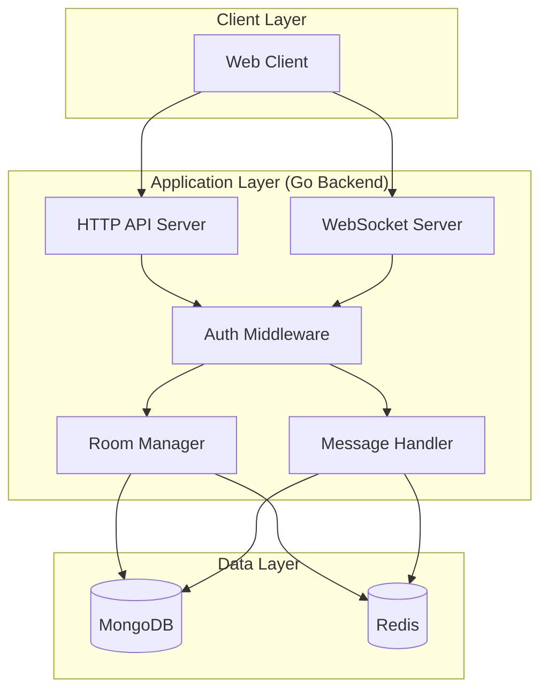

# Simple Chat MVP - Architectural Design

## 1. Overall System Architecture



### Architecture Overview

The chat MVP follows a simple three-tier architecture:

1. **Client Layer**: A simple web frontend that connects via HTTP API and WebSocket
2. **Application Layer**: Go backend handling REST API and WebSocket connections
3. **Data Layer**: MongoDB for persistent storage and Redis for caching

### Key Components

- **HTTP API Server**: Handles REST endpoints for room management, message history, etc.
- **WebSocket Server**: Manages real-time bidirectional communication
- **Auth Middleware**: Validates x-auth-key for user identification
- **Room Manager**: Manages chat rooms and user memberships
- **Message Handler**: Processes message delivery and storage

## 2. MongoDB Data Models

### User Collection

```json
{
  "_id": "ObjectId",
  "authKey": "string (unique identifier)",
  "username": "string",
  "createdAt": "datetime",
  "lastSeen": "datetime"
}
```

### Room Collection

```json
{
  "_id": "ObjectId",
  "name": "string",
  "description": "string (optional)",
  "createdBy": "string (user authKey)",
  "createdAt": "datetime",
  "members": ["string (user authKey)"]
}
```

### Message Collection

```json
{
  "_id": "ObjectId",
  "roomId": "ObjectId",
  "senderAuthKey": "string",
  "content": "string",
  "timestamp": "datetime",
  "type": "string (text, system, etc.)"
}
```

## 3. Redis Cache Structure

### Room Active Users

```
Key: room:{roomId}:users
Type: Set
Value: Set of user authKeys currently in the room
TTL: 30 minutes (refreshed on activity)
```

### User Sessions

```
Key: session:{authKey}
Type: Hash
Fields:
  - username: string
  - lastSeen: timestamp
  - currentRoom: roomId (optional)
TTL: 24 hours
```

### Recent Messages Cache

```
Key: room:{roomId}:recent_messages
Type: List
Value: Recent message objects (JSON)
TTL: 1 hour
Max Length: 100 messages
```

### Room Metadata

```
Key: room:{roomId}:meta
Type: Hash
Fields:
  - name: string
  - memberCount: number
  - lastActivity: timestamp
TTL: 6 hours
```

## 4. API Endpoints and WebSocket Events

### HTTP API Endpoints

#### User Management

- `GET /api/user/profile` - Get user profile
- `PUT /api/user/profile` - Update user profile

#### Room Management

- `GET /api/rooms` - List available rooms
- `POST /api/rooms` - Create a new room
- `GET /api/rooms/{roomId}` - Get room details
- `POST /api/rooms/{roomId}/join` - Join a room
- `POST /api/rooms/{roomId}/leave` - Leave a room

#### Message History

- `GET /api/rooms/{roomId}/messages` - Get message history (with pagination)

### WebSocket Events

#### Client to Server

- `join_room` - Join a room
  ```json
  {
    "event": "join_room",
    "data": {
      "roomId": "string"
    }
  }
  ```
- `leave_room` - Leave a room
  ```json
  {
    "event": "leave_room",
    "data": {
      "roomId": "string"
    }
  }
  ```
- `send_message` - Send a message
  ```json
  {
    "event": "send_message",
    "data": {
      "roomId": "string",
      "content": "string"
    }
  }
  ```

#### Server to Client

- `room_joined` - Confirmation of joining a room
  ```json
  {
    "event": "room_joined",
    "data": {
      "roomId": "string",
      "roomName": "string",
      "onlineUsers": ["string"]
    }
  }
  ```
- `room_left` - Confirmation of leaving a room
  ```json
  {
    "event": "room_left",
    "data": {
      "roomId": "string"
    }
  }
  ```
- `new_message` - New message in the room
  ```json
  {
    "event": "new_message",
    "data": {
      "id": "string",
      "roomId": "string",
      "sender": "string",
      "content": "string",
      "timestamp": "datetime"
    }
  }
  ```
- `user_joined` - User joined the room
  ```json
  {
    "event": "user_joined",
    "data": {
      "roomId": "string",
      "username": "string"
    }
  }
  ```
- `user_left` - User left the room
  ```json
  {
    "event": "user_left",
    "data": {
      "roomId": "string",
      "username": "string"
    }
  }
  ```

## 5. Project Structure Recommendations

```
chat/
├── cmd/
│   └── server/
│       └── main.go              # Application entry point
├── internal/
│   ├── api/                     # HTTP API handlers
│   │   ├── handlers.go
│   │   ├── middleware.go
│   │   └── routes.go
│   ├── websocket/              # WebSocket handlers
│   │   ├── server.go
│   │   ├── events.go
│   │   └── hub.go
│   ├── models/                  # Data models
│   │   ├── user.go
│   │   ├── room.go
│   │   └── message.go
│   ├── services/                # Business logic
│   │   ├── auth.go
│   │   ├── room.go
│   │   └── message.go
│   ├── database/                # Database connections
│   │   ├── mongodb.go
│   │   └── redis.go
│   └── config/                  # Configuration
│       └── config.go
├── pkg/                         # Public packages
│   └── utils/
│       └── helpers.go
├── web/                         # Frontend assets
│   ├── index.html
│   ├── style.css
│   └── app.js
├── docker-compose.yaml
├── go.mod
└── README.md
```

## 6. Technology Stack Details

### Backend (Go)

- **Web Framework**: `net/http` (standard library) + `gorilla/mux` for routing
- **WebSocket**: `gorilla/websocket`
- **MongoDB Driver**: `go.mongodb.org/mongo-driver`
- **Redis Client**: `github.com/go-redis/redis/v8`
- **Configuration**: Environment variables or config file
- **Logging**: Standard library `log` package

### Frontend

- **HTML5/CSS3/JavaScript (ES6+)**
- **WebSocket API** for real-time communication
- **Fetch API** for REST calls
- **No framework** (keeping it simple for MVP)

### Database

- **MongoDB**: Document storage for messages, rooms, and users
- **Redis**: In-memory caching for active sessions and recent messages

### Infrastructure

- **Docker & Docker Compose**: Containerization and orchestration
- **Environment**: Development environment with hot reload

## 7. Implementation Considerations

### Authentication

- Simple x-auth-key header validation
- No password or session management
- Auto-create users on first request with valid auth key

### Message Flow

1. Client sends message via WebSocket
2. Server validates and stores in MongoDB
3. Server caches recent messages in Redis
4. Server broadcasts to all room members via WebSocket
5. Update room activity timestamp

### Room Management

- Dynamic room creation
- No private rooms for MVP
- Room membership tracked in Redis and MongoDB

### Scalability Considerations

- Redis for reducing database load
- Connection pooling for MongoDB
- WebSocket connection limits
- Message history pagination

### Error Handling

- Standardized error responses
- WebSocket error events
- Graceful degradation when Redis is unavailable

## 8. Security Considerations for MVP

- Input validation and sanitization
- Rate limiting on message sending
- Basic XSS protection in frontend
- CORS configuration for API
- No sensitive data in logs

This architecture provides a solid foundation for a simple chat MVP while keeping the implementation straightforward and focused on core functionality.
