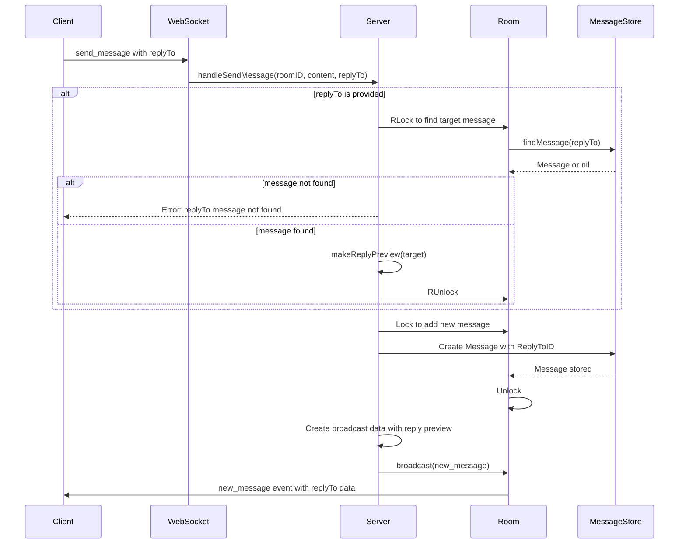
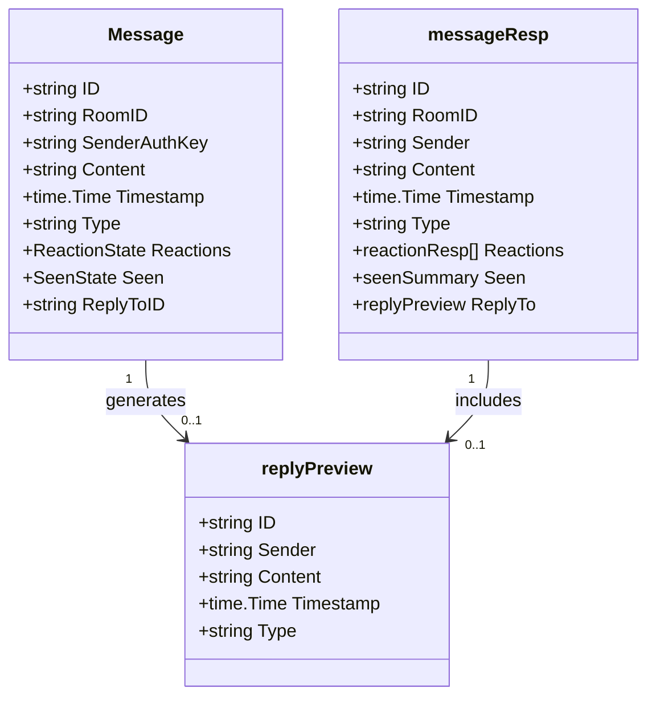
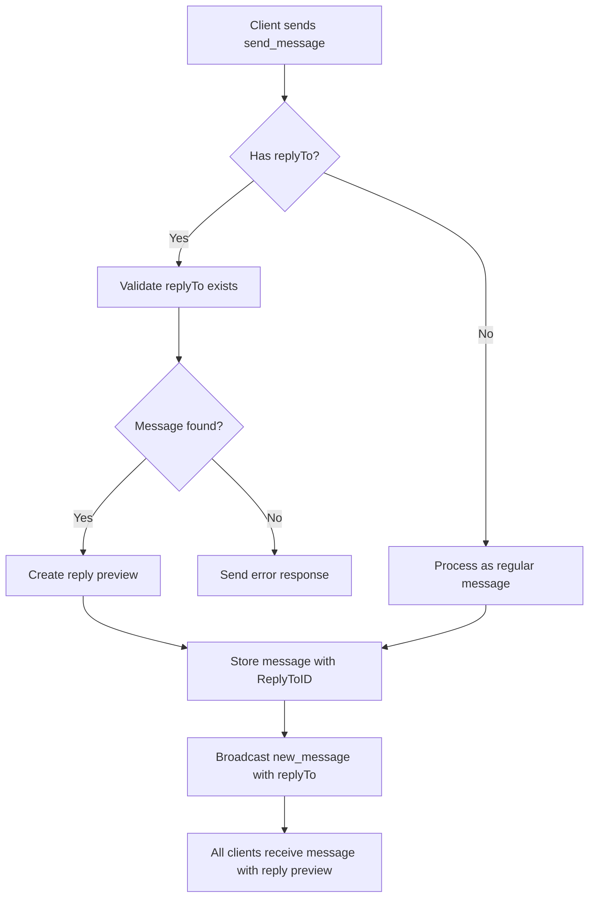

# Reply Message Mechanism Flow Diagram

## Message Reply Flow



## Data Structure Changes



## WebSocket Message Flow



## HTTP API Response Structure

```mermaid
json
{
  "messages": [
    {
      "id": "msg-123",
      "roomId": "room-abc",
      "sender": "user-auth-key",
      "content": "This is a reply",
      "timestamp": "2025-10-28T01:23:45Z",
      "type": "text",
      "reactions": [],
      "seen": {
        "count": 2,
        "users": ["Alice", "Bob"]
      },
      "replyTo": {
        "id": "msg-456",
        "sender": "Bob",
        "content": "Original message content that might be very long...",
        "timestamp": "2025-10-28T01:22:10Z",
        "type": "text"
      }
    }
  ]
}
```

## Implementation Components

1. **Data Model Updates**

   - Add `ReplyToID` to `Message` struct
   - Add `replyPreview` struct for API responses

2. **Helper Functions**

   - `makeReplyPreview()` - Creates preview from message
   - `replyPreviewByID()` - Safely retrieves preview by ID
   - `trimRunes()` - Utility for content trimming

3. **HTTP API Changes**

   - Update `messageResp` to include `ReplyTo` field
   - Modify `getMessages` handler to populate reply previews

4. **WebSocket Changes**

   - Update `send_message` payload to accept `replyTo`
   - Modify `handleSendMessage` to validate and store replies
   - Include reply preview in `new_message` broadcasts

5. **Validation Logic**
   - Ensure reply target exists in the same room
   - Handle cases where reply target is not found
