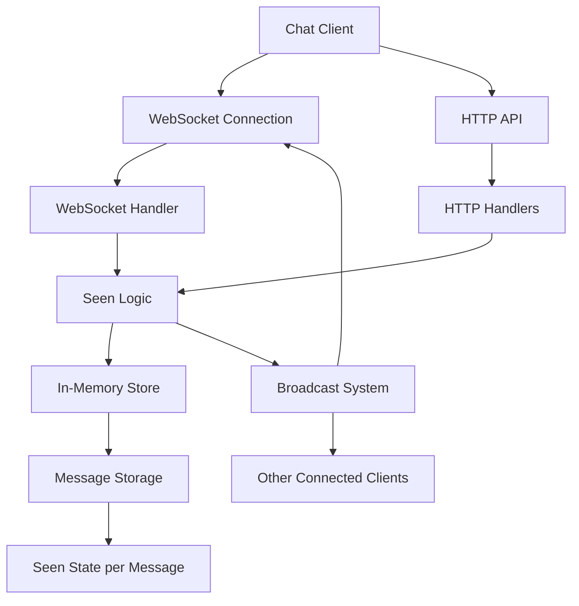
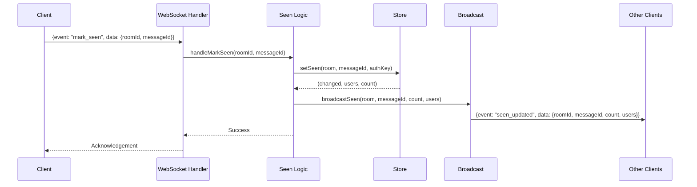
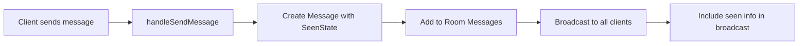
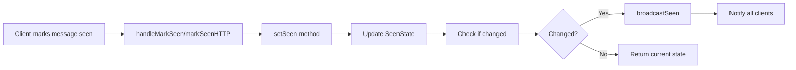

# Seen Mechanism Architecture

## System Architecture Overview



## Data Flow for Marking Message as Seen



## Data Model Relationships

```mermaid
erDiagram
    User {
        string AuthKey
        string Username
        time CreatedAt
        time LastSeen
    }

    Message {
        string ID
        string RoomID
        string SenderAuthKey
        string Content
        time Timestamp
        string Type
        ReactionState Reactions
        SeenState Seen
    }

    Room {
        string ID
        string Name
        string Description
        string CreatedBy
        time CreatedAt
        map Members
        [] Messages
        map conns
    }

    User ||--o{ Message : sends
    Room ||--o{ Message : contains
    Room ||--o{ User : has_members
```

## Component Interaction

### 1. Message Creation Flow



### 2. Mark as Seen Flow



## API Endpoints

### HTTP API

- `PUT /api/rooms/:roomId/messages/:messageId/seen`
  - Marks a specific message as seen by the authenticated user
  - Returns updated seen information

### WebSocket Events

- `mark_seen` (Client → Server)

  ```json
  {
    "event": "mark_seen",
    "data": {
      "roomId": "room-123",
      "messageId": "msg-456"
    }
  }
  ```

- `seen_updated` (Server → Clients)
  ```json
  {
    "event": "seen_updated",
    "data": {
      "roomId": "room-123",
      "messageId": "msg-456",
      "count": 3,
      "users": ["Alice", "Bob", "Charlie"]
    }
  }
  ```

## State Management

### SeenState Structure

```go
type SeenState map[string]time.Time // authKey -> seenAt
```

### seenSummary Structure

```go
type seenSummary struct {
    Count int      `json:"count"`
    Users []string `json:"users,omitempty"` // usernames
}
```

## Implementation Considerations

### Thread Safety

- All message operations require room mutex lock
- SeenState updates are atomic within locked context
- Broadcast operations use read locks

### Performance

- SeenState is only included in API responses when explicitly requested
- Broadcast events only include summary information (count and usernames)
- Message lookup by index is O(n) but acceptable for typical chat room sizes

### Memory Usage

- Each message maintains a map of who has seen it
- System messages start with empty seen state
- Old messages are pruned based on room's maxHist setting

## Edge Cases Handled

1. **Non-existent message**: Returns appropriate error
2. **Unauthorized access**: Handled by existing auth middleware
3. **Duplicate seen requests**: Idempotent operation
4. **System messages**: Can be marked as seen like regular messages
5. **User leaves room**: Seen state is preserved for historical messages

## Testing Strategy

### Unit Tests

- Test setSeen method with various scenarios
- Test summarizeSeen conversion
- Test findMessageIndex edge cases

### Integration Tests

- Test HTTP endpoint with authentication
- Test WebSocket event handling
- Test broadcast functionality
- Test concurrent access scenarios

### End-to-End Tests

- Verify seen state updates across multiple clients
- Test message creation with initial seen state
- Verify seen information in message lists
