# Thread Architecture Diagram

## System Overview

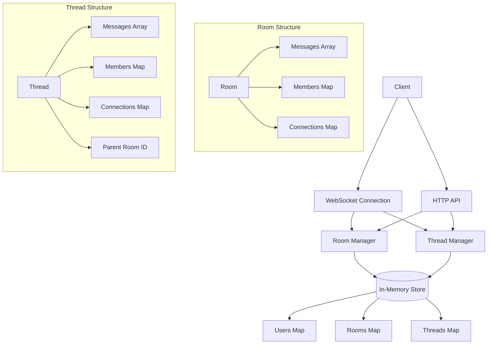

## Thread Creation Flow

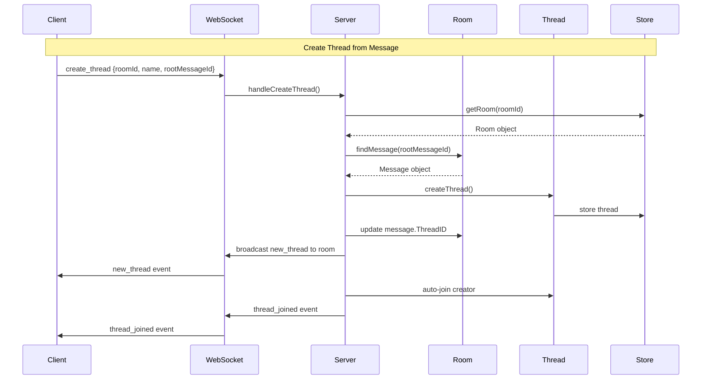

## Thread Message Flow

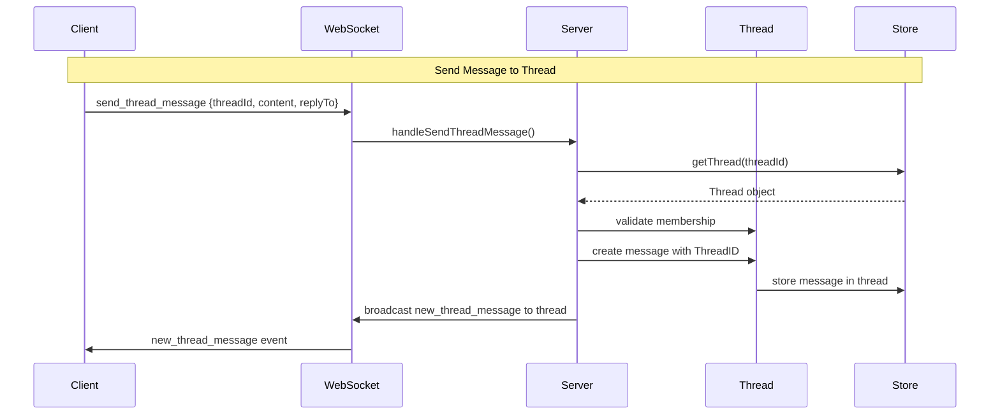

## Thread Join/Leave Flow

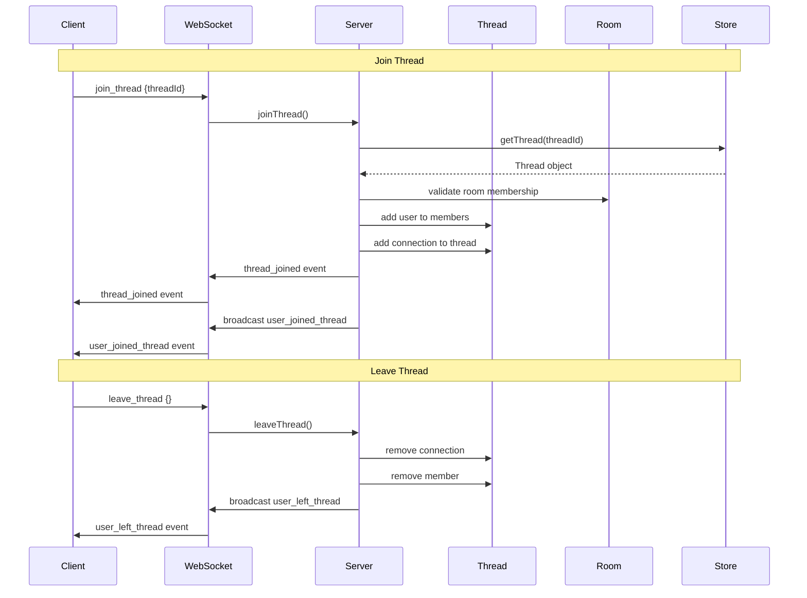

## Data Relationships

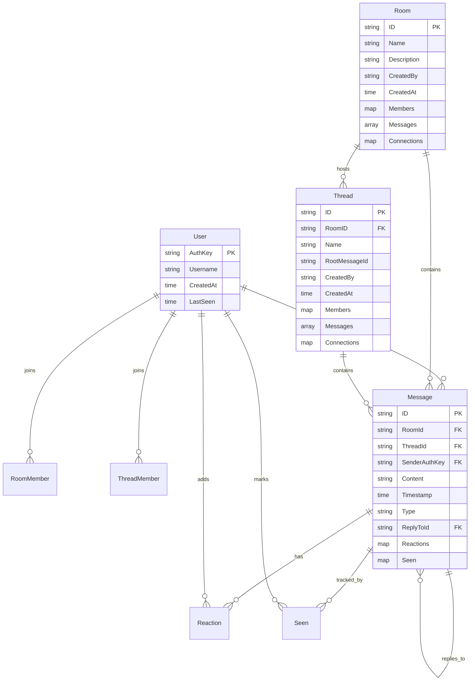

## WebSocket Event Flow

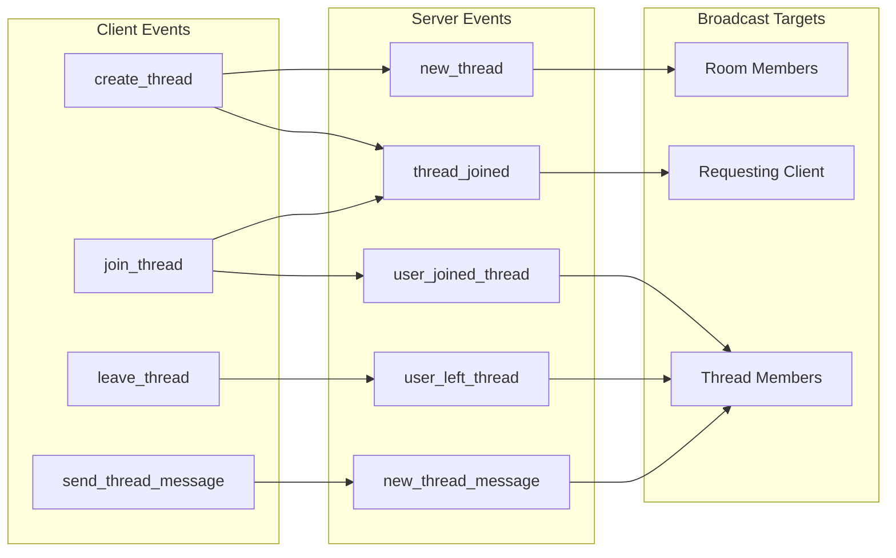

## HTTP API Endpoints

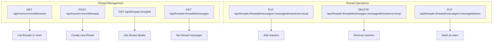

## Frontend Component Structure

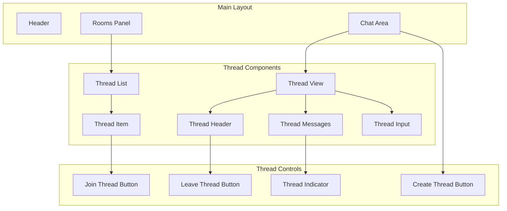

## State Management Flow

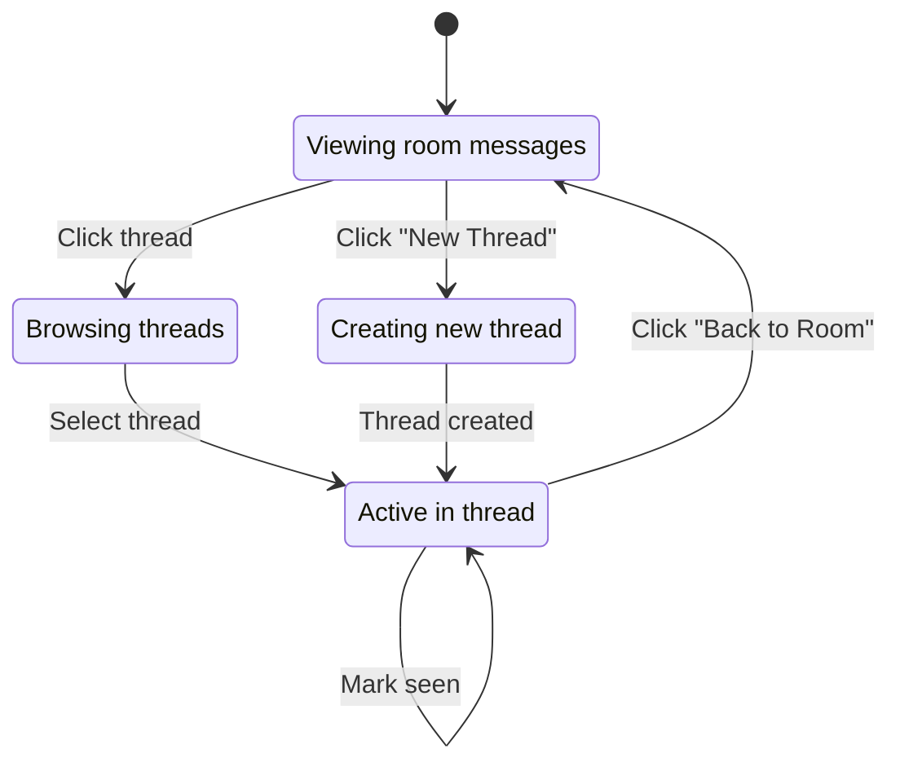

## Error Handling Flow

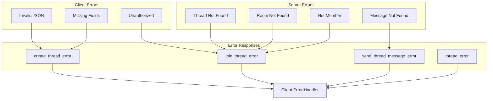

## Performance Considerations

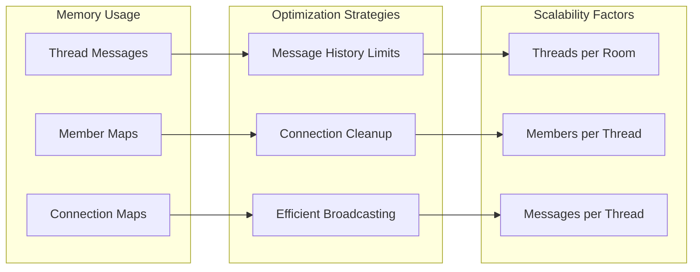

This architecture provides a comprehensive threading system that integrates seamlessly with the existing room-based chat while maintaining performance and scalability.
