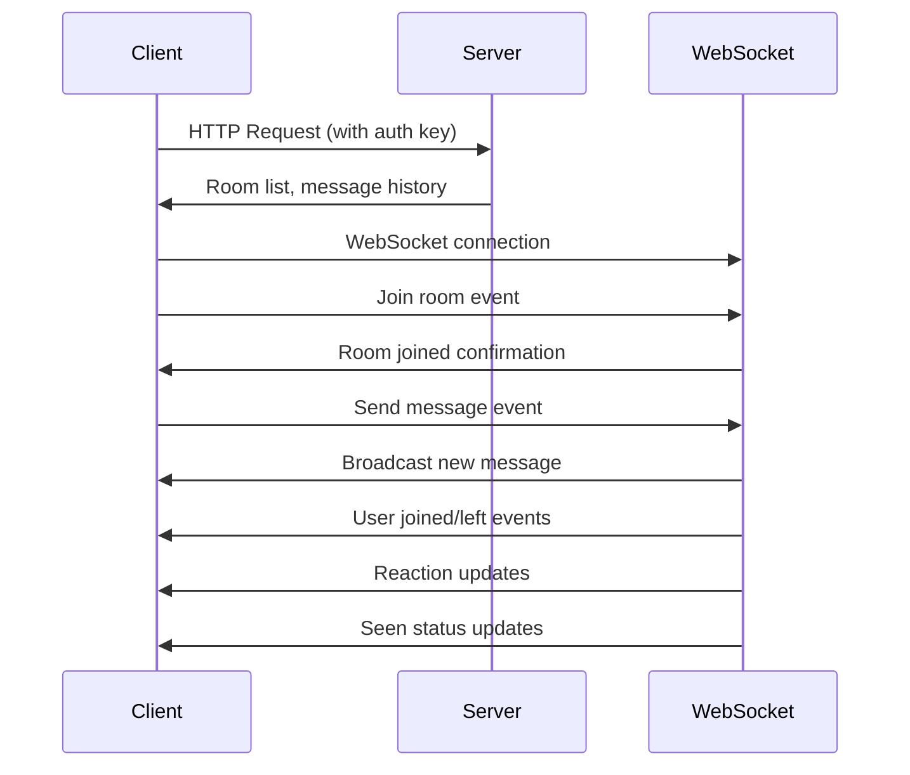

# Simple Chat AIO

A real-time chat application built with Go backend and HTML/JavaScript frontend, featuring WebSocket communication, rooms, threads, replies, reactions, and message status tracking.

## Features

### Core Chat Functionality

- **Real-time Messaging**: Instant message delivery using WebSocket connections
- **Room Management**: Create, join, and leave chat rooms
- **User Authentication**: Simple auth-key based identification system
- **Message History**: Persistent message storage with pagination support

### Advanced Features

- **Thread System**: Discord-style threads for organized conversations
- **Reply Mechanism**: Reply to specific messages with visual threading
- **Message Reactions**: Add emoji reactions to messages
- **Seen Status**: Track which users have seen messages
- **Online User Detection**: Real-time user presence in rooms

### Technical Highlights

- **WebSocket Implementation**: Bidirectional real-time communication
- **In-Memory Storage**: Fast, lightweight data persistence
- **Concurrent Connections**: Handle multiple simultaneous users
- **Event-Driven Architecture**: Efficient message broadcasting

## Quick Start

### Prerequisites

- Go 1.25.1 or higher
- Modern web browser with WebSocket support

### Installation

1. Clone the repository:

```bash
git clone https://github.com/yourusername/simple-chat-aio.git
cd simple-chat-aio
```

2. Install dependencies:

```bash
go mod download
```

3. Run the server:

```bash
go run main.go
```

4. Open your browser and navigate to:

```
http://localhost:8080
```

### Using the Frontend

The application includes a ready-to-use HTML client (`chat.html`):

1. Open `chat.html` in your browser or access via the running server
2. The client automatically generates an auth key and username
3. Join the default "General" room or create a new room
4. Start chatting in real-time!

## Architecture

### Backend (Go)

- **Framework**: Gin HTTP router with Gorilla WebSocket
- **Storage**: In-memory data structures for simplicity
- **Concurrency**: Goroutines for handling multiple connections
- **Authentication**: Simple auth-key middleware

### Frontend (HTML/JavaScript)

- **No Framework Dependency**: Vanilla JavaScript for maximum compatibility
- **WebSocket Client**: Native WebSocket API integration
- **Real-time Updates**: Event-driven UI updates
- **Responsive Design**: Mobile-friendly interface

### Data Flow



## API Documentation

### HTTP Endpoints

#### User Management

- `GET /api/user/profile` - Get current user profile
- `PUT /api/user/profile` - Update user profile

#### Room Management

- `GET /api/rooms` - List all rooms
- `POST /api/rooms` - Create new room
- `GET /api/rooms/{roomId}` - Get room details
- `POST /api/rooms/{roomId}/join` - Join a room
- `POST /api/rooms/{roomId}/leave` - Leave a room
- `GET /api/rooms/{roomId}/messages` - Get room messages

#### Thread Management

- `GET /api/rooms/{roomId}/threads` - List threads in room
- `POST /api/rooms/{roomId}/threads` - Create new thread
- `GET /api/threads/{threadId}` - Get thread details
- `GET /api/threads/{threadId}/messages` - Get thread messages

#### Message Interactions

- `PUT /api/rooms/{roomId}/messages/{messageId}/reactions/{emoji}` - Add reaction
- `DELETE /api/rooms/{roomId}/messages/{messageId}/reactions/{emoji}` - Remove reaction
- `PUT /api/rooms/{roomId}/messages/{messageId}/seen` - Mark message as seen

### WebSocket Events

#### Client to Server

- `join_room` - Join a room
- `leave_room` - Leave a room
- `send_message` - Send message to room
- `create_thread` - Create new thread
- `join_thread` - Join a thread
- `leave_thread` - Leave a thread
- `send_thread_message` - Send message to thread
- `add_reaction` - Add reaction to message
- `remove_reaction` - Remove reaction from message
- `toggle_reaction` - Toggle reaction on/off
- `mark_seen` - Mark message as seen

#### Server to Client

- `room_joined` - Room join confirmation
- `user_joined` - User joined room
- `user_left` - User left room
- `new_message` - New message in room
- `new_thread` - New thread created
- `thread_joined` - Thread join confirmation
- `user_joined_thread` - User joined thread
- `user_left_thread` - User left thread
- `new_thread_message` - New message in thread
- `reaction_updated` - Message reaction updated
- `seen_updated` - Message seen status updated

## Project Structure

```
simple-chat-aio/
├── main.go              # Main application entry point
├── go.mod              # Go module definition
├── go.sum              # Go module checksums
├── chat.html            # Frontend client
├── LICENSE              # Apache 2.0 license
├── README.md            # This file
└── docs/               # Documentation
    ├── architecture-design.md
    ├── thread-implementation-*.md
    ├── reply-implementation-*.md
    ├── seen-implementation-*.md
    └── ...
```

## Configuration

The application uses the following default configuration:

- **Server Port**: 8080
- **WebSocket Endpoint**: `/ws`
- **API Base Path**: `/api`
- **CORS Origins**: `http://127.0.0.1:5500`, `http://localhost:5500`, `http://localhost:8080`
- **Message History Limit**: 200 messages per room/thread

## Development

### Running in Development Mode

1. Install dependencies:

```bash
go mod download
```

2. Run the server:

```bash
go run main.go
```

3. For hot reload during development, consider using:

```bash
go install github.com/cosmtrek/air@latest
air
```

### Testing the WebSocket Connection

You can test the WebSocket connection using browser developer tools:

1. Open the browser console
2. Connect to WebSocket:

```javascript
const ws = new WebSocket(
  "ws://localhost:8080/ws?authKey=test-key&username=test-user"
);
```

3. Send events:

```javascript
ws.send(
  JSON.stringify({
    event: "join_room",
    data: { roomId: "room-abc123" },
  })
);
```

## Contributing

We welcome contributions! Please see [CONTRIBUTING.md](CONTRIBUTING.md) for guidelines.

### Development Setup

1. Fork the repository
2. Create a feature branch:

```bash
git checkout -b feature/your-feature-name
```

3. Make your changes
4. Run tests:

```bash
go test ./...
```

5. Commit your changes:

```bash
git commit -m "Add your feature"
```

6. Push to your fork:

```bash
git push origin feature/your-feature-name
```

7. Create a Pull Request

## License

This project is licensed under the Apache License 2.0 - see the [LICENSE](LICENSE) file for details.

## Acknowledgments

- [Gin Web Framework](https://github.com/gin-gonic/gin) - HTTP router
- [Gorilla WebSocket](https://github.com/gorilla/websocket) - WebSocket implementation
- [gin-contrib/cors](https://github.com/gin-contrib/cors) - CORS middleware

## Performance Considerations

### Memory Usage

- Current implementation uses in-memory storage
- Each room maintains a message history buffer (default: 200 messages)
- WebSocket connections are tracked in memory

### Scalability

- Suitable for small to medium deployments
- For larger deployments, consider:
  - Database persistence (PostgreSQL, MongoDB)
  - Redis for session management
  - Horizontal scaling with load balancers

### Optimization Tips

- Monitor memory usage with growing message history
- Implement message cleanup for old content
- Consider connection pooling for database operations

## Security Notes

### Current Implementation

- Simple auth-key based authentication
- Input validation on all endpoints
- CORS configuration for browser clients
- XSS protection in frontend (HTML escaping)

### Production Considerations

- Implement proper authentication system
- Add rate limiting for message sending
- Use HTTPS in production
- Validate and sanitize all user inputs
- Implement proper session management

## Troubleshooting

### Common Issues

**WebSocket Connection Fails**

- Check if server is running on port 8080
- Verify CORS configuration
- Check browser console for specific errors

**Messages Not Appearing**

- Ensure you've joined a room
- Check browser console for JavaScript errors
- Verify WebSocket connection status

**High Memory Usage**

- Reduce message history limit
- Implement message cleanup
- Monitor for memory leaks

### Debug Mode

Enable debug logging by setting environment variable:

```bash
export DEBUG=true
go run main.go
```

## Future Enhancements

Planned features for future releases:

- Database persistence options
- User authentication with passwords
- File sharing capabilities
- Message editing and deletion
- Private messaging
- Push notifications
- Mobile app
- Message search functionality
- User roles and permissions
